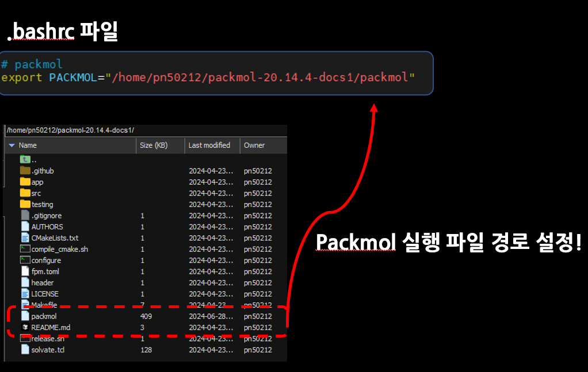

# CCELKit Packmol 모듈

CCELKit의 Packmol 모듈은 분자 시스템을 생성하기 위한 도구입니다. 이 모듈은 고체, 유체체 상태의 분자들을 조합하여 시스템을 구성할 수 있습니다.

## 필수 조건

- PACKMOL이 설치되어 있어야 하며, 환경 변수에 등록되어 있어야 합니다.




- ASE (Atomic Simulation Environment)
- NumPy
- PyYAML

## 사용 방법

### 1. 디렉토리 초기화

```bash
ccelkit make_system init_dir
```

다음과 같은 디렉토리 구조가 생성됩니다:

root_dir/
├── src/
│ ├── solid/
│ ├── fluid/
│ └── cell_POSCAR


### 2. 시스템 설정 방법

#### 2.1 수동 설정
각 디렉토리에 필요한 분자 구조 파일을 src 폴더의 적절한 위치에에 직접 배치합니다:
- `src/solid/`: 고체 상태 분자 구조 파일 (POSCAR, xyz, cif, pdb 형식). 해당 타입의 원자들은 위치가 고정된 상태로 전체 시스템에 배치됩니다.
- `src/fluid/`: 유체 상태 분자 구조 파일. 해당 타입의 원자들은 전체 시스템에 미리 설정된 밀도를 가지면서 랜덤 위치로 흩뿌려집니다.
- `cell_POSCAR`: 시스템 전체 cell 정보를 설정하기 위해서만 사용되는 POSCAR 파일입니다. 내부의 원자들이 있어도 무시됩니다. 

#### 2.2 Preset 기능 사용
빠른 시스템 설정을 위해 preset 기능을 사용할 수 있습니다:

```bash
ccelkit make_system init_config --preset
```

Preset 기능은 다음 단계들을 대화형으로 안내합니다:
1. Cell 설정
   - cell 크기(x, y, z)를 직접 입력하거나 스킵 가능
   - 스킵 시 기존 cell_POSCAR 파일이 필요
2. 유체 분자 설정
   - ASE의 g2 collection에서 제공하는 분자들 중 선택
   - 't'를 입력하여 종료

### 2.2 Preset 기능 사용 X

```bash
ccelkit make_system init_config
```

현재 설정된 src 폴더를 읽어서 `config_init.yml` 파일을 제작합니다. 이 파일에서 다음 설정들을 수정할 수 있습니다:
- 각 유체 분자의 밀도
- tolerance: 분자 간 최소 거리
- seed: 난수 생성 시드
- population: 생성할 시스템의 수

### 4. 시스템 생성
- config 파일의 설정대로 시스템을 생성합니다.


```bash
ccelkit make_system -c {config 파일 경로로}
```


## 주의사항

1. cell_POSCAR의 벡터는 반드시 직교해야 합니다.
2. 분자 구조 파일의 이름은 `_POSCAR` 또는 확장자를 제외한 부분이 config 파일의 키값으로 사용됩니다.
3. 생성된 시스템은 `out` 디렉토리에 저장됩니다.
4. preset 기능 사용 시 ASE의 g2 collection에 있는 분자만 선택 가능합니다.

## 출력 파일

- `out/system_{index:02d}_POSCAR`: 최종 생성된 시스템 구조 (index는 시스템 인덱스)
- `out/liquid_gas_packmol_{index:02d}.inp`: Packmol 입력 파일
- `out/liquid_gas_packmol_{index:02d}.xyz`: Packmol 출력 파일


## 예시 01: MoS2 with H2S gas system 생성

### 1. 준비물
- MoS2 with graphene nanohole 시스템 POSCAR 파일


### 2. ccelkit make_system init_dir 명령어 실행
- 기본적인 src 폴더의 형식을 생성합니다.


### 3. src 폴더 채우기
- solid 폴더으로 준비한 "MoS2 with graphene nanohole 시스템 POSCAR 파일" 을 옮깁니다.

- 전체 cell의 lattice와 유체 분자들은 ccelkit make_system init_config --preset 명령어로 생성합니다.


### 4. config 파일 채우기.
- ccelkit make_system init_config 명령어의 결과로 config_init.yml 파일이 생성됩니다. 이 파일을 수정하여 전체 system 의 설정을 확정합니다.


### 5. 전체 시스템 생성하기.
- ccelkit make_system -c config_init.yml 명령어로 전체 시스템을 해당 설정 파일의 설정을 따라 생성합니다.

