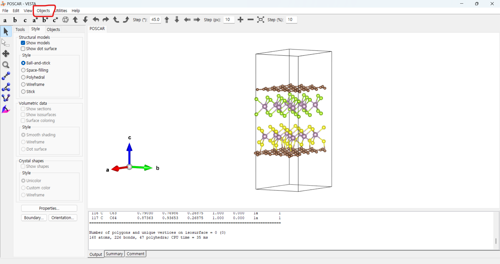
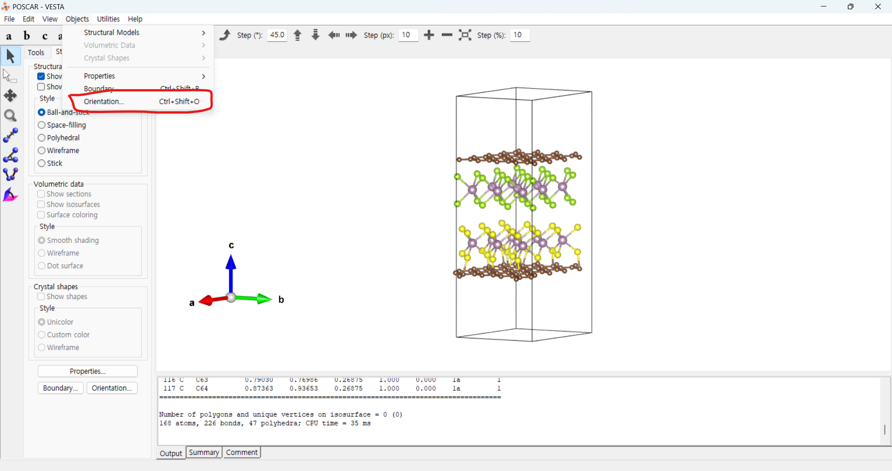
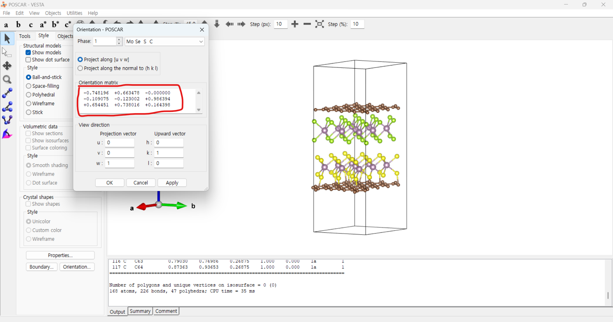

# CCELKIT Visual 기능 사용법

CCELKIT의 visual 기능은 원자 구조 파일을 POV-Ray를 사용하여 고품질 이미지로 렌더링하는 도구입니다.

## 필수 요구사항

- POV-Ray가 설치되어 있어야 합니다 (설치 방법은 https://www.notion.so/aracho/Server-POVRAY-install-d827f5157a534446a960a1fbc42de3f0 참고)
- 환경 변수 `POVRAY`에 POV-Ray 설치 경로가 지정되어 있어야 합니다
```bash
# for example,in ".bashrc" file
export POVRAY="/home/pn50212/povray-3.6"
```

## 사용 방법

### 기본 사용자 (Light User) 가이드

기본 사용자는 최소한의 옵션으로 빠르게 이미지를 생성할 수 있습니다.

#### 1. 단일 파일 처리

```bash
# 기본 렌더링
ccelkit visual -i structure.vasp -o output.png
```

#### 2. 여러 파일 일괄 처리

```bash
# POSCAR 파일 모두 처리
ccelkit visual --target POSCAR
```

### 고급 사용자 (Advanced User) 가이드

고급 사용자는 다양한 옵션을 조절하여 원하는 결과를 얻을 수 있습니다.

#### 1. 구조 반복 및 격자 표시

```bash
ccelkit visual -i structure.vasp -o output.png -r 2 2 1 --cell_on
```

#### 2. 특정 방향에서 보기

다음과 같은 preset이 준비되어 있습니다:
- top: 위에서 보기
- side_x: x축 방향에서 보기 
- side_y: y축 방향에서 보기
- perspective: 사선 방향에서 보기

```bash
ccelkit visual -i structure.vasp -o output.png -ori "top"
```
##### 카메라 방향 조절 방법


 

#### 3. 원자 색상 및 투명도 설정

```bash
# 투명도 설정
ccelkit visual -i structure.vasp -o output.png -t 0.5 0.3 0.7

# 히트맵 설정
ccelkit visual -i structure.vasp -o output.png -H 0.2 0.5 0.8
```

#### 4. 설정 파일(config.yaml) 사용

고급 사용자는 설정 파일을 통해 복잡한 설정을 관리할 수 있습니다.

```bash
ccelkit visual -c config.yaml
```

##### 기본 설정 파일 생성

```bash
ccelkit visual create_config
```

##### 설정 파일 구조 (config.yaml)

```yaml
target: "POSCAR"              # 대상 파일 패턴
input_filepath: null          # 입력 파일 경로
output_filepath: null         # 출력 파일 경로
repeatation: [1, 1, 1]        # 구조 반복
orientation: "perspective"     # 카메라 방향
cell_on: true                 # 격자 표시 여부
transmittances: null          # 원자 투명도
heatmaps: null                # 원자 히트맵
canvas_width: 800             # 이미지 너비
color_species:                # 원자 종류별 색상
  # Re: [0.580, 0, 0.827]
  # H: [0.529, 0.808, 0.980]
color_index:                  # 원자 인덱스별 색상
  # 0: [0.580, 0, 0.827]
  # 1: [0.529, 0.808, 0.980]
frame_per_second: 24         # 출력 GIF 프레임 속도
postfix:"" # 이미지 파일의 접미사사
```

## 주의사항

- `traj` 파일 또는 `XDATCAR` 파일을 입력으로 받을 경우, 자동으로 GIF 파일로 변환됩니다.
- `target` 옵션 사용 시 출력 파일명은 자동으로 'img_'가 접두사로 붙습니다
- `target`과 `input_filepath`/`output_filepath`는 동시에 사용할 수 없습니다
- 색상값은 RGB 형식으로 0~1 사이의 값을 사용합니다
- 투명도와 히트맵 값은 원자 수만큼 지정해야 합니다


